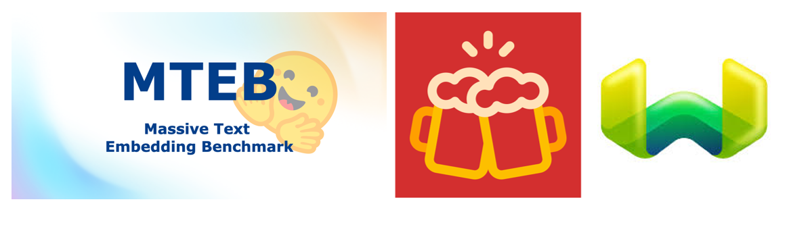

# Information retrieval, embedding models, vector search and its benchmarks

Welcome to the repository for this techathon about **information retrieval**:
*finding documents of text that satisfies the information need from within a large collection.*

The first step in information retrieval is to convert the unstructured text in a vector representation that allows optimized search techniques. This is done with an embedding model. Which embedding models are out there and how to decide which one to use for your application? How are embedding models compared? We will investigate and gain an understanding of text embedding benchmarks, the datasets, tasks and metrics involved. We will set up a local vector database, weaviate, and try to reproduce the benchmark process with an embedding model of your choice (from huggingface). Here we will explore the different settings for vector search available in weaviate. Finally, we will discuss how to setup an evaluation for your own use case.

We will learn about embedding models, benchmarks,  vector databases and search by finding answers to the questions defined below. Good luck!

## The Questions

### The Embedding model 
- What is an embedding model?
- How is an embedding model trained?
- On what properties do the embedding models differ?
- Which embedding model would you like to test and why?

### Comparison of embedding models
- On which tasks are embedding models compared?
- What is the difference between reranking and retrieval tasks?
- What are the different datasets used for the retrieval tasks, its different properties?
- What is the format of the datasets? Understand corpus, queries, qrels.
- What are the evaluation metrics used for information retrieval in BEIR and in MTEB?
- Is there anything you find in the evaluation approach that stands out?
- Which dataset is interesting for your use case and why?

### Vector database
- What are alternatives to Weaviate and what are pros and cons?
- What does Weaviate embed in the vector?
- What can be changed in preprocessing and for different languages?
- What does hybrid search do?
- Which parameters are adjustable for hybrid search?
- What is the default distance metric for vector search?
- What are different ranking methods and how do they influence the vector search?
- Which parameters should be chosen in weaviate to reproduce a benchmark evaluation?

### Performing evaluation
- How does the evaluation metric compare to the benchmarks?
- If there is a discrepancy, do you have an idea where it might come from?

## Resources

- [Massive Text Embedding Benchmark Leaderboard](https://huggingface.co/spaces/mteb/leaderboard)
- [Information about benchmark datasets](https://github.com/beir-cellar/beir)
- [How to evaluate pre-trained models on BEIR datasets - colab](https://colab.research.google.com/drive/1HfutiEhHMJLXiWGT8pcipxT5L2TpYEdt?usp=sharing)
- [MTEB paper, Massive Test Embedding Benchmark](references/MTEB_2023.pdf)
- [BEIR paper, Benchmark Evaluation of Infromation Retrieval Models](references/BEIR_2021.pdf)
- [Weaviate documentation](https://weaviate.io/developers/weaviate)
  - [Hybrid search](https://weaviate.io/developers/weaviate/search/hybrid)
  - [text2vec-transformers](https://weaviate.io/developers/weaviate/modules/retriever-vectorizer-modules/text2vec-transformers)
  - [Collection schema](https://weaviate.io/developers/weaviate/config-refs/schema)
  - [Getting started with Weaviate Python Library](https://towardsdatascience.com/getting-started-with-weaviate-python-client-e85d14f19e4f)
- [Weaviate RAG evaluation blog](https://weaviate.io/blog/rag-evaluation)

## Prerequisites to run an evaluation locally

* Install [Docker Desktop](https://www.docker.com/products/docker-desktop/) for your operating system. No docker license needed, use is for educational purpose.
* Run `docker-compose build` in the root of this repository (fast internet connection recommended for downloading the model).
* Run `docker-compose up` in the root of this repository.

Test by going to http://localhost:8080/v1 if the weaviate database has started.

* Have package manager [poetry](https://python-poetry.org/docs/) installed
* Have Python 3.11 installed
* (if you want the venv to be in this repo, first set `poetry config virtualenvs.in-project true`)
* run `poetry install` in the root of this repository to create a venv 

## Try it out

You can run an evaluation using this mini application consisting of the weaviate vector database filled with a benchmark dataset.

- unzip  `scifact.zip` to a folder in `vectorsearch_benchmark` called `datasets` .
- perform the prerequisites as described above
- run `ingestion.py` e.g. by `poetry run python ingestion.py` in the `vectorsearch_benchmark` folder or using your IDE run configurations
- run `evaluation.py`

Note: Runs fine on my laptop but if you run into time out errors, try to reduce the `BATCH_SIZE` in `ingestion.py`

## Ideas
- Experiment with weaviate vector search parameters in `evaluation.py`
- Change the embedding model in the build args in the `docker-compose.yaml`
- Investigate another dataset